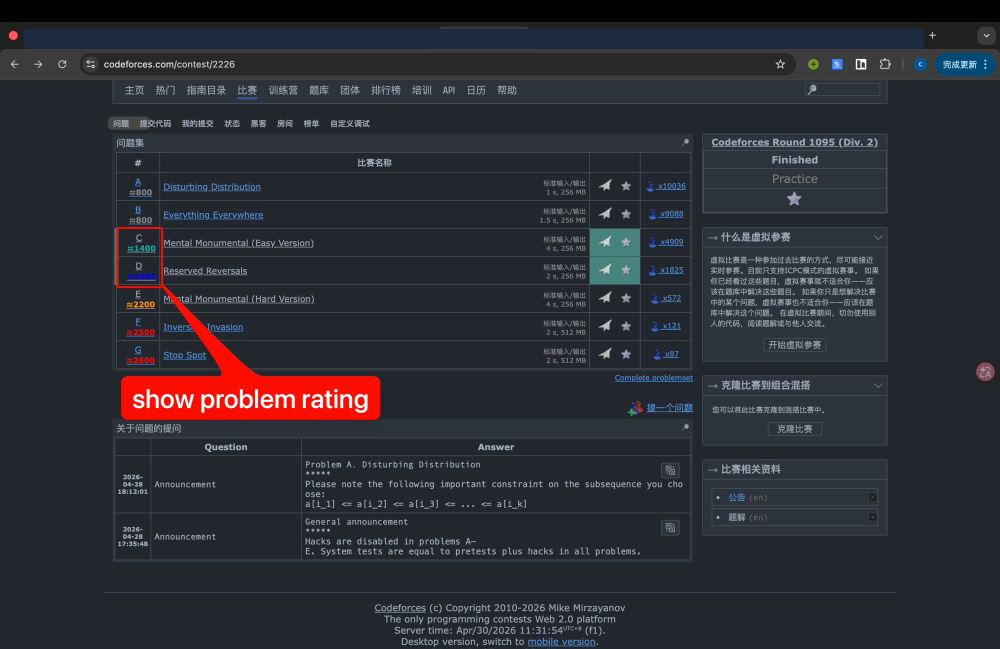
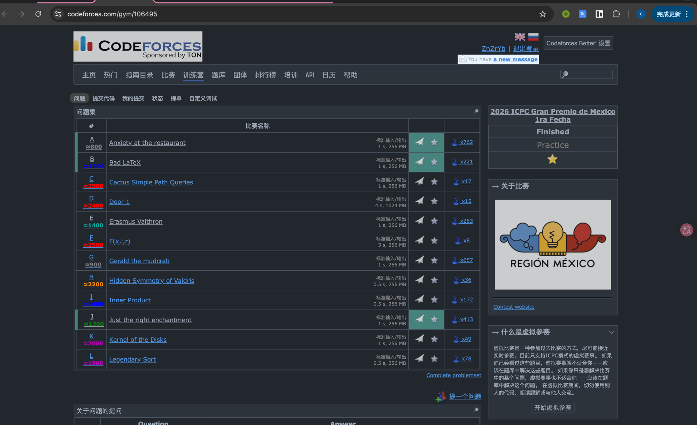
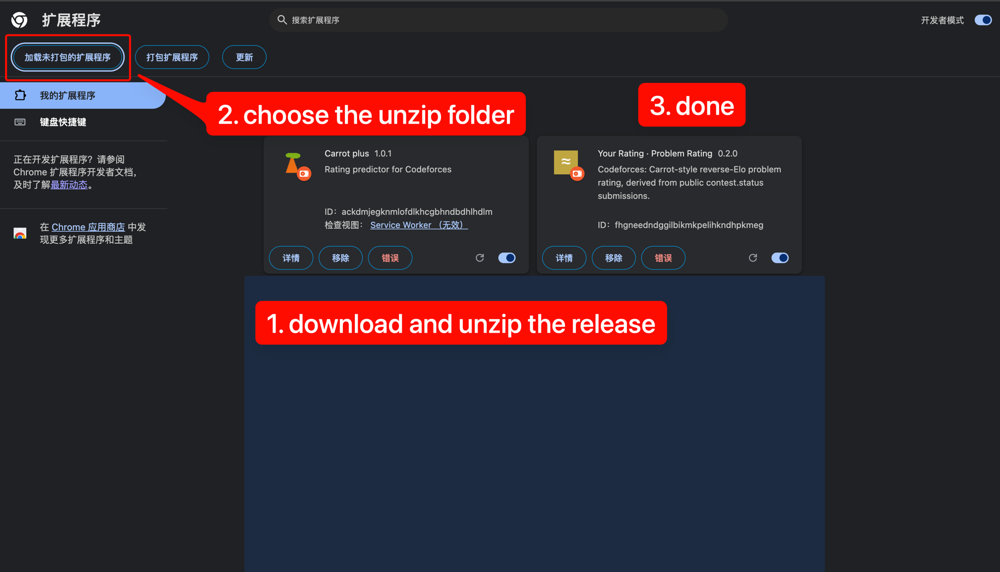
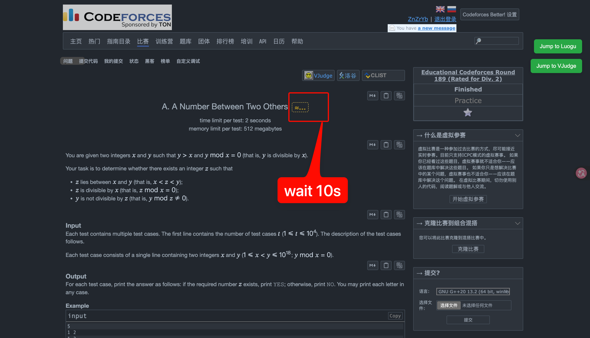
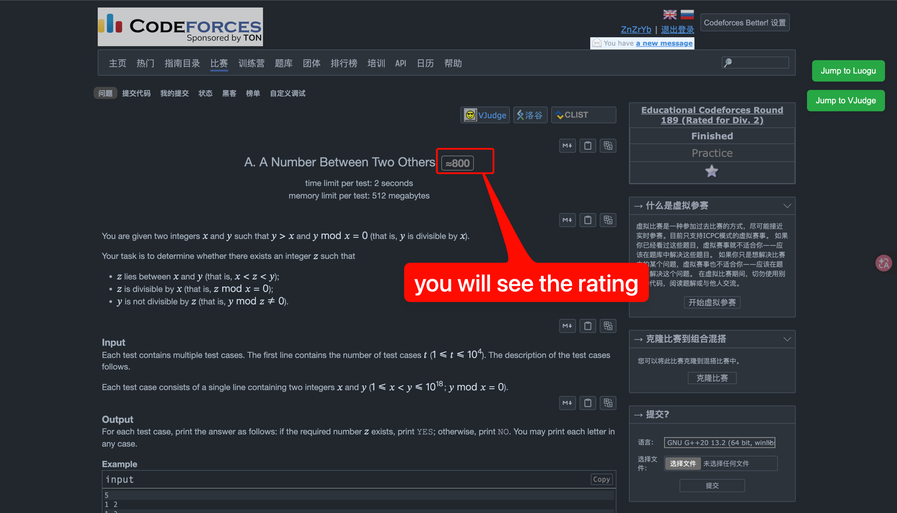
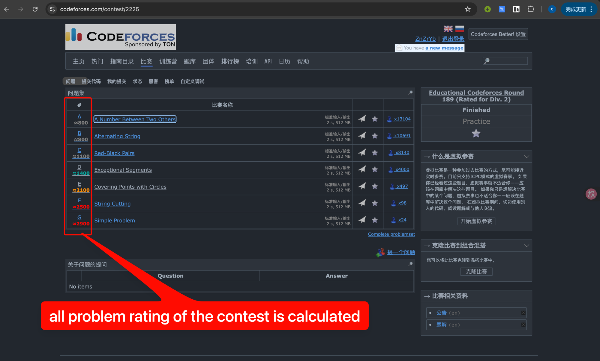

# Your Rating · Problem Rating

> Codeforces 题目「推断 rating」徽章 Chrome 扩展。在题目页和比赛题目列表页直接显示 Carrot 风格的反向 Elo 推断难度，只调用 CF 公开 API，本地计算，不依赖第三方服务。

---

## 中文说明

### 这是什么

打开 CF 比赛题目列表页（`/contest/<id>`）或单题页（`/contest/<id>/problem/X`），每道题旁边会多出一个 `≈XXXX` 徽章，颜色跟 CF 段位色一致：



适合**还没有官方 rating** 的题目：刚结束 / 还没更新的轮次、Gym、合并 Div 的部分题目。

**Gym 团队赛同样支持**——每队按 `max(队员 rating)` 折算成一个样本进 Elo 拟合：



### 工作原理

1. 拉这场比赛的全部 `contest.status` 提交（公开匿名 API）；
2. 过滤出比赛窗口内、非 ghost 的有效提交。常规 round 只收 `CONTESTANT`；Gym 同时收 `CONTESTANT` / `VIRTUAL`（vp） / `OUT_OF_COMPETITION`，挡掉噪音大的 `PRACTICE`。然后按队伍重建 (队伍 → 解出的题目集合)；
3. 批量 `user.info` 查每位队员的赛前 rating，每队取最高分作为该样本的 effective rating；
4. 对每道题二分 `R_X`，使
   $$\sum_i \frac{1}{1 + 10^{(R_X - R_i)/400}} \approx \text{该题解出人数}$$
   也就是 Carrot 用的那套反向 Elo 拟合。

### 安装（开发者模式加载）



1. 到 [Releases](https://github.com/znzryb/Your_Rating_Problem_Rating/releases) 下载最新的 `your-rating-problem-rating-vX.Y.Z.zip` 并解压；
2. Chrome 打开 `chrome://extensions`，右上角打开**开发者模式**，点**加载已解压的扩展程序**，选解压出来的目录；
3. 打开任意 CF 比赛题目页，先看到一个虚线占位徽章 `≈…`，等大约 10 秒：



4. 数据拉完后徽章会替换成带颜色的 `≈XXXX`：



5. 同样也在比赛题目列表页 `/contest/<id>` 上工作，整场比赛所有题目的推断 rating 一次性出齐：



### 自己编译

```bash
npm install
npm run build
```

构建产物落在 `dist/`（同时会 rsync 到 `~/chrome-extensions/your-rating-problem-rating/`，那是作者本机的开发目录，不影响你直接拿 `dist/` 装）。

### 已知限制

- 团队赛按"队员里最高 rating"折算样本——这是 CF 不暴露团队 rating 时的近似，跟实际"队伍水平"会差一点；
- 没有赛前 rating 的全新账号会被排除在样本外；
- 反向 Elo 只是一阶近似，不考虑首杀时间和 wrong-attempt，跟 CF 官方 setter 给的 rating 会有出入，结果当**估算**看；
- Gym `PRACTICE` 提交不计入（题解公开后的练习样本噪音太大），所以纯 PRACTICE 的 gym 可能算不出 rating；
- 大场（>1 万人）首跑要 10–30s 拉提交，结果会缓存 24 小时；
- CF API 偶发返回 5xx / 429 会自动指数退避重试；某批 `user.info` 因为有被删除的 handle 整批 400 时，那批样本会被跳过，剩余样本照常拟合。

### 不做的事

- **不**做 rating delta / Δ 预测——[Carrot](https://github.com/meooow25/carrot) 已经做得很好，不重复造轮子；
- **不**调用 `clist.by` 或任何第三方服务——只走 codeforces.com 公开 API；
- **不**碰登录态、不读 cookie、不发任何请求到 codeforces 之外。

---

## English

### What it is

A Chrome MV3 extension that adds a `≈XXXX` inferred-rating badge next to each problem on a Codeforces contest's problem list page (`/contest/<id>`) and on individual problem pages. Color follows CF rank colors:


Useful for problems that **don't have an official rating yet** — finished-but-not-yet-updated rounds, Gym contests, some merged-Div rounds.

**Gym team contests are supported too** — each team is collapsed to a single Elo sample with rating = `max(member ratings)`:


### How it works

1. Fetch all submissions for the contest via `contest.status` (anonymous public API).
2. Filter to in-window non-ghost rows. Regular rounds: `CONTESTANT` only. Gym: `CONTESTANT` / `VIRTUAL` (vp) / `OUT_OF_COMPETITION`, with `PRACTICE` excluded (post-editorial noise). Then rebuild `(party → set of solved problems)`, keyed by sorted member-handles so a 3-member team is one row.
3. Batch `user.info` to look up each member's pre-contest rating; for team rows, the team's effective rating is `max` over its members.
4. For each problem, binary-search `R_X` such that
   $$\sum_i \frac{1}{1 + 10^{(R_X - R_i)/400}} \approx \text{number of solvers},$$
   the same reverse-Elo fit Carrot uses.

### Install (unpacked from release)


1. Grab the latest `your-rating-problem-rating-vX.Y.Z.zip` from [Releases](https://github.com/znzryb/Your_Rating_Problem_Rating/releases) and unzip it.
2. Open `chrome://extensions`, toggle **Developer mode** on, click **Load unpacked**, and pick the unzipped folder.
3. Open any CF contest problem page. You'll first see a dashed `≈…` placeholder badge — give it ~10 seconds:


4. Once the data is fetched, the placeholder is replaced with the colored `≈XXXX` badge:


5. The contest list page `/contest/<id>` works too — every problem in the round gets its inferred rating in one shot:


### Build from source

```bash
npm install
npm run build
```

Output lands in `dist/` (and is also rsynced to `~/chrome-extensions/your-rating-problem-rating/` — that's the author's local dev sink, you can ignore it and load `dist/` directly).

### Known limits

- Team contests use `max(member ratings)` per team as the Elo sample — a coarse proxy when CF doesn't expose team ratings.
- Brand-new accounts with no pre-contest rating are excluded.
- Reverse-Elo is a first-order approximation — it ignores time-to-solve and wrong-attempt patterns that CF's internal setter accounts for. Treat the badge as "ballpark", not "official".
- Gym `PRACTICE` submissions are excluded (post-editorial noise), so a pure-practice Gym contest may not have enough signal to fit.
- Large rounds (>10k participants) need 10–30s the first time to pull submissions; results are cached for 24 hours.
- Transient CF API errors (5xx / 429) are retried with exponential backoff; if one `user.info` batch 400s because of a deleted handle, that batch is skipped and the remaining samples still produce a result.

### Non-goals

- **No** rating-delta / Δ predictions — [Carrot](https://github.com/meooow25/carrot) already does this well; no point duplicating.
- **No** third-party services like `clist.by` — only codeforces.com public API.
- **No** auth, cookies, or off-CF network calls.

---

## References

- [Mike Mirzayanov — Codeforces Rating System](https://codeforces.com/blog/entry/20762)
- [meooow25/carrot](https://github.com/meooow25/carrot) — reference implementation of CF rating prediction; this project's `contest.status` rebuild path mirrors Carrot's `rebuildStandingsFromStatus`.
